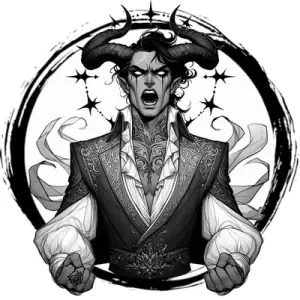

## ARCHDEVIL

_A stunningly beautiful, horned human with burning, red eyes and a halo of seven black stars. Two stitched-up gashes weep blood from its shoulder blades._

**AC** 19, **HP** 76, **ATK** 4 iron scepter +10 (3d10) or 1 soulbind, **MV** far (teleport), **S** +5 **D** +4 **C** +4 **I** +5 **W** +4 **Ch** +7, **AL** C, **LV** 16

**Impervious:** Fire immune. Only damaged by magical sources.

**Crown of Darkness:** All hostile spells are reflected at caster with a spellcasting check less than 20.

**Soulbind:** All targets within near DC 20 CHA or fall under control of archdevil for 1d4 rounds. DC 20 CHA on turn to end the effect.

