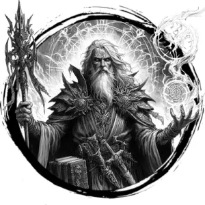

## ARCHMAGE

_A wizened magic-user crackling with arcane power._

**AC** 12, **HP** 44, **ATK** 2 spell +7, **MV** near, **S** -1 **D** +2 **C** -1 **I** +4 **W** +2 **Ch** +1, **AL** L, **LV** 10

**Death Bolt (INT Spell):** DC 15. One target of LV 9 or less within near DC 15 CON or go to 0 HP.

**Enervate (INT Spell):** DC 14. Focus. One target within near is stupefied for the duration.

**Fireblast (INT Spell):** DC 14. 4d6 damage to all within a near-sized cube within far.

**Float (INT Spell):** Self. DC 14. Fly double near for 5 rounds.

**Mithralskin (INT Spell):** Self. DC 14. AC becomes 18 for 5 rounds.

**Void Step (INT Spell):** Self and up to 4 willing targets. DC 15.

