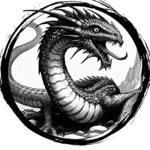

## BASILISK

_Massive, muscled lizards with six legs and gray, tough hide._

**AC** 14, **HP** 25, **ATK** 2 bite +4 (2d6 + petrify), **MV** near, **S** 3 **D** 1 **C** 3 **I** -3 **W** 1 **Ch** -3, **AL** N, **LV** 5

**Petrify:** Any creature that touches the basilisk or meets its gaze, DC 15 CON or petrified.

