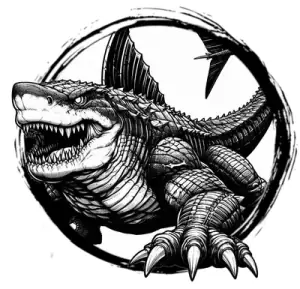

## BULETTE

_A hulking, shark-sized lizard with a steely, arrow-shaped carapace and a massive gullet._

**AC** 17, **HP** 40, **ATK** 3 bite +5 (2d6) or 1 leap, **MV** near (burrow), **S** +5 **D** +1 **C** +4 **I** -3 **W** +1 **Ch** -2, **AL** N, **LV** 8

**Leap:** Jump up to near in height and double near in distance, then make 2 bite attacks.

