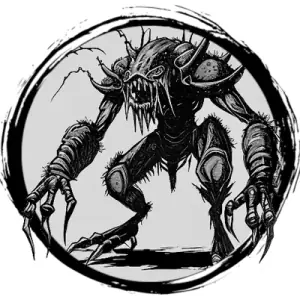

## CAVE BRUTE

_A hulking, insectoid beast with long mandibles, four eyes, and thick arms covered in bristles._

**AC** 14, **HP** 28, **ATK** 2 claw +5 (1d8) and 1 mandible +5 (1d10), **MV** near (burrow), **S** +4 **D** +1 **C** +1 **I** -3 **W** +1 **Ch** -3, **AL** N, **LV** 6

**Bewilder:** Creatures within near that see the cave brute's eyes, DC 12 CHA at start of their turn or dazed and no action.

