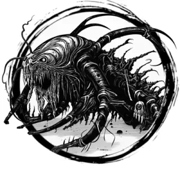

## CAVE CREEPER

_Chittering, green centipedes the size of horses. Their grasping tentacles are coated in a paralytic venom._

**AC** 12, **HP** 18, **ATK** 1 bite +3 (1d6) and 1 tentacles +3 (1d8 + toxin), **MV** near (climb), **S** 2 **D** 2 **C** 0 **I** -3 **W** 1 **Ch** -3, **AL** N, **LV** 4

**Toxin:** DC 12 CON or paralyzed 1d4 rounds.

