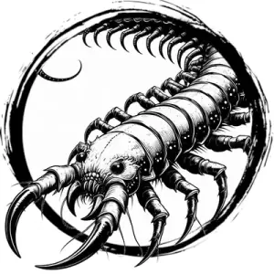

## CENTIPEDE, GIANT

_Blood-red, feathery centipedes the size of a human arm. Their bite injects a burning poison that cramps muscles._

**AC** 11, **HP** 4, **ATK** 1 bite +1 (1d4 + poison), **MV** near (climb), **S** -3 **D** +1 **C** +0 **I** -4 **W** -3 **Ch** -4, **AL** N, **LV** 1

**Poison:** DC 12 CON or paralyzed 1d4 rounds.

