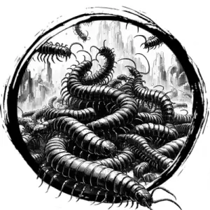

## CENTIPEDE, SWARM

_A crawling mass of weaving, sinuous centipedes._

**AC** 11, **HP** 18, **ATK** 3 bite +1 (1d4 + poison), **MV** near (climb), **S** -3 **D** 1 **C** 0 **I** -4 **W** -3 **Ch** -4, **AL** N, **LV** 4

**Poison:** DC 12 CON or paralyzed 1d4 rounds.

