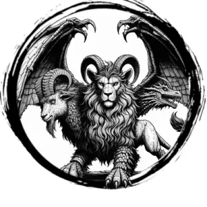

## CHIMERA

_A monstrous beast with a half-goat, half-lion body, wide dragon wings, and the heads of a goat, lion, and dragon._

**AC** 16, **HP** 49, **ATK** 4 rend +7 (2d8) and 1 fire breath, **MV** double near (fly), **S** +5 **D** +4 **C** +4 **I** -3 **W** +2 **Ch** -1, **AL** C, **LV** 10

**Fire Breath:** Fills a near-sized cube extending from chimera. DC 15 DEX or 4d6 damage.

