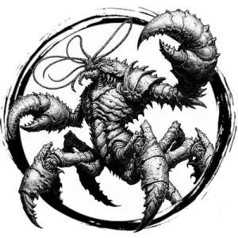

## CHUUL

_Brown, horse-sized lobster bugs with tentacles and pincers._

**AC** 15, **HP** 25, **ATK** 2 pincer +4 (1d8 + grab), **MV** near (swim), **S** 3 **D** -1 **C** 3 **I** -1 **W** 1 **Ch** -2, **AL** C, **LV** 5

**Grab:** DC 15 STR or held in pincer. DC 15 STR on turn to break free.

