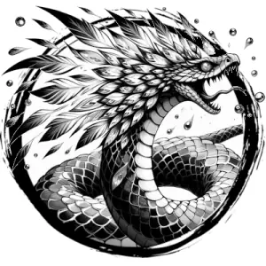

## COUATL

_A human-sized snake with scales made of jewels and a corona of iridescent feathers._

**AC** 16, **HP** 42, **ATK** 3 bite +6 (2d6 + poison), **MV** near (fly), **S** 2 **D** 3 **C** 2 **I** 4 **W** 4 **Ch** 5, **AL** L, **LV** 9

**Change Shape:** In place of attacks, transform into any similarly-sized creature.

**Poison:** DC 15 CON or fall into natural, deep sleep for 1d8 hours.

**Restore:** In place of attacks, touch one creature to remove a curse, affliction, or heal 3d8 HP.

