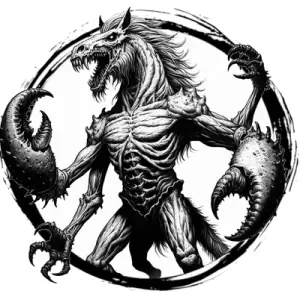

## DEMON, GLABREZU

_Horse-headed, fanged creatures who walk upright and have four arms; two shriveled, and two ending in hulking pincers._

**AC** 15, **HP** 40, **ATK** 2 pincer +7 (2d8 + crush), **MV** near, **S** +4 **D** +1 **C** +4 **I** +3 **W** +2 **Ch** +2, **AL** C, **LV** 8

**Crush:** DC 15 STR or target takes 2d8 damage.

