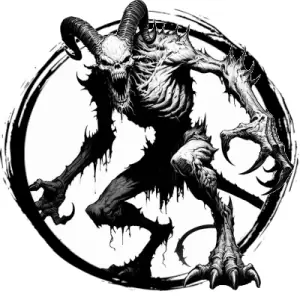

## DEVIL, BARBED

_Lanky, green-mottled fiends bristling with hooked spines._

**AC** 13, **HP** 14, **ATK** 2 spine (near) +3 (1d6 + barb) or 1 fire blast (far) +3 (1d8), **MV** near, **S** +2 **D** +3 **C** +1 **I** +1 **W** +1 **Ch** +1, **AL** C, **LV** 3

**Barb:** Each spine sticks, dealing 1d4 damage each round. DC 12 STR check on turn to remove.

