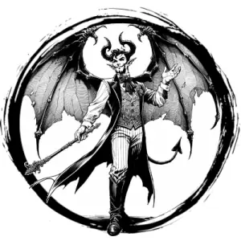

## DEVIL, CUBI

_Entrancing humanoids with bat wings and devilish charm._

**AC** 14, **HP** 29, **ATK** 1 kiss +4 (1d6 + drain) or 1 charm, **MV** near (fly), **S** 2 **D** 4 **C** 2 **I** 3 **W** 2 **Ch** 5, **AL** C, **LV** 6

**Change Shape:** In place of attacks, transform into any similarly-sized humanoid.

**Charm:** One humanoid in near DC 15 CHA or bewitched by cubi for 1d6 hours.

**Drain:** The target takes 1d6 WIS damage. A target reduced to 0 WIS this way swears its soul to an archdevil.

