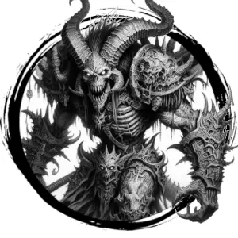

## DEVIL, HORNED

_Iron-scaled hellions as big as ogres with weighty ram horns, lashing tails, and leathery wings. They are opportunistic and craven in battle._

**AC** 16, **HP** 35, **ATK** 2 burning trident (near) +7 (2d6) or 1 fire blast (far) +4 (2d8), **MV** double near (fly), **S** 5 **D** 2 **C** 4 **I** 2 **W** 1 **Ch** 2, **AL** C, **LV** 7

**Iron Hide:** Half damage from non-magical weapons.

