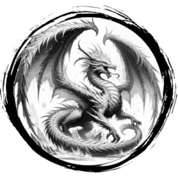

## DRAGON, FROST

_Prismatic ice lines the horns, spines, and wings of this pearly dragon. Clouds of steam hiss from its ice-rimed jaws._

**AC** 17, **HP** 68, **ATK** 4 rend +9 (2d10) or 1 ice breath, **MV** double near (fly), **S** 4 **D** 3 **C** 5 **I** 3 **W** 4 **Ch** 3, **AL** N, **LV** 14

**Frostblood:** Cold immune.

**Ice Breath:** Fills a double near-sized cube extending from dragon. DC 15 DEX or 4d8 damage and frozen for 1 round.

