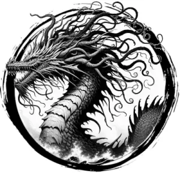

## DRAGON, SEA

_A warm sea breeze blows around this amphibious, gold-scaled wyrm. A beard of tendrils covers its snout, and a blue mane billows along its neck._

**AC** 17, **HP** 76, **ATK** 4 rend +10 (2d10) or 1 steam breath or 1 water spout, **MV** double near (fly, **S** 5 **D** 6 **C** 4 **I** 4 **W** 5 **Ch** 5, **AL** L, **LV** 16

**Steam Breath:** Fills a double near-sized cube extending from dragon. DC 15 DEX or 4d12 damage.

**Water Spout:** Fills a near-sized cube within far. DC 15 STR or creatures inside flung 2d100 feet in a random direction.

