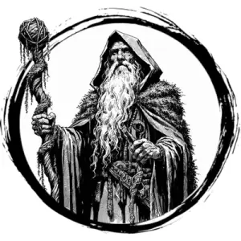

## DRUID

_A wizard of the wilds holding a knotted staff and wearing a mossy cloak of deep viridian._

**AC** 11, **HP** 31, **ATK** 1 staff +0 (1d4) or 2 spell +5, **MV** near, **S** +0 **D** +1 **C** +0 **I** +4 **W** +3 **Ch** +0, **AL** N, **LV** 7

**Barkskin (INT Spell):** Self. DC 13. AC becomes 15 for 5 rounds.

**Conjure Flames (INT Spell):** DC 12. One target in far takes 2d6 damage.

**Imbue (INT Spell):** Self. DC 13. Staff becomes a +3 magic weapon for 10 rounds.

**Summon Bear (INT Spell):** DC 14. Summon a loyal brown bear that appears within near. It stays for 5 rounds.

**Thunderclap (INT Spell):** DC 13. Fills a near-sized cube extending from druid. Creatures within are thrown 2d20 feet in a random direction.

