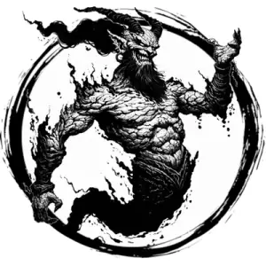

## EFREETI

_Blood-red, towering humanoids formed of lava and ash. Short, black horns and snarling grins._

**AC** 15, **HP** 43, **ATK** 3 scimitar +8 (2d10) or 2 fire bolt (far) +5 (2d6), **MV** near (fly), **S** 5 **D** 2 **C** 3 **I** 3 **W** 2 **Ch** 3, **AL** C, **LV** 9

**Impervious:** Only damaged by magical sources. Fire immune.

**Wall of Flame:** 1/day, 20' high curtain of fire, double near length. Touching it deals 4d8 damage. Lasts 2d4 rounds.

**Wish:** Cast wish once a week for a mortal, no spellcasting check.

