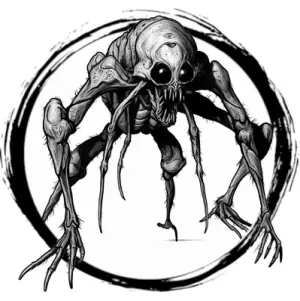

## ETTERCAP

_Bipedal, eight-eyed spiderfolk with spindly legs and purple fur._

**AC** 12, **HP** 14, **ATK** 2 bite +2 (1d6) or 1 poison web (near) +2, **MV** near (climb), **S** 0 **D** 2 **C** 1 **I** 0 **W** 0 **Ch** -1, **AL** C, **LV** 3

**Poison Web:** One target stuck in place and 1d4 damage/round. DC 12 DEX on turn to escape.

