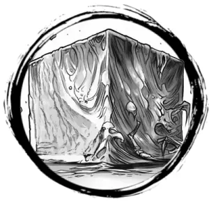

## GELATINOUS CUBE

_A translucent cube of slime that silently mows through tunnels._

**AC** 11, **HP** 24, **ATK** 1 touch +4 (1d8 + toxin + engulf), **MV** near, **S** 3 **D** 1 **C** 2 **I** -4 **W** 1 **Ch** -4, **AL** N, **LV** 5

**Engulf:** DC 12 STR or trapped inside cube. Touch attack auto-hits engulfed targets each round. DC 12 STR on turn to escape. Fail checks if paralyzed.

**Rubbery:** Half damage from stabbing weapons.

**Toxin:** DC 15 CON or paralyzed 1d4 rounds.

