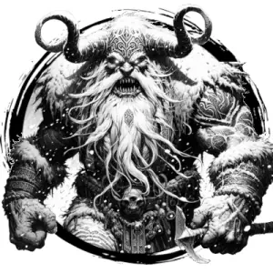

## GIANT, FROST

_Blue-skinned warriors with broad shoulders and braided hair. They sound war horns during their frequent raids to pillage nearby settlements._

**AC** 14 (chainmail), **HP** 44, **ATK** 3 greataxe +8 (2d10), **MV** double near, **S** +5 **D** +1 **C** +4 **I** +2 **W** +3 **Ch** +2, **AL** C, **LV** 9

**Frostblood:** Cold immune.

