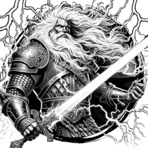

## GIANT, STORM

_Regal titans with sea-green skin, flowing white hair, and thundering voices. They breathe water as easily as air._

**AC** 15 (mithral chainmail), **HP** 58, **ATK** 3 greatsword +10 (2d12) or 1 lightning bolt, **MV** double near (swim), **S** 6 **D** 2 **C** 4 **I** 3 **W** 4 **Ch** 4, **AL** L, **LV** 12

**Stormblood:** Electricity immune.

**Lightning Bolt:** 3/day, 5' wide line extending far from giant. All creatures in line DC 15 DEX or 5d10 damage. DISADV on check if in water.

