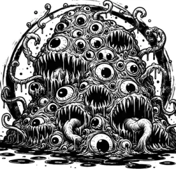

## GIBBERING MOUTHER

_Crawling masses of slime with dozens of screeching, lipless mouths and wet eyeballs._

**AC** 8, **HP** 21, **ATK** 2 bite +3 (1d8 + latch), **MV** near (climb, **S** 2 **D** -2 **C** 3 **I** -3 **W** 0 **Ch** -3, **AL** N, **LV** 4

**Gibbering:** Creatures within near DC 12 WIS on turn or take a random action (d8): 1-3. do nothing, 4-5. move in random direction, 6-7. attack nearest creature, 8. flee.

**Latch:** Attach to bitten target; bites auto-hit next round. DC 12 STR on turn to tear off.

