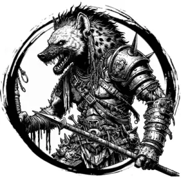

## GNOLL

_Barbaric, opportunistic hyena-folk who range in large packs._

**AC** 12 (leather), **HP** 10, **ATK** 1 spear (close/near) +1 (1d6) or 1 longbow (far) +1 (1d8), **MV** near, **S** 1 **D** 1 **C** 1 **I** -1 **W** 0 **Ch** -1, **AL** C, **LV** 2

**Rage:** 1/day, immune to morale checks, +1d4 damage (3 rounds).

