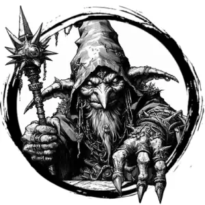

## GOBLIN, SHAMAN

_A swaying, chanting goblin wearing necklaces of teeth and a robe of musty rat pelts._

**AC** 12 (leather), **HP** 19, **ATK** 1 staff +0 (1d4) or 1 spell +3, **MV** near, **S** +0 **D** +1 **C** +1 **I** +0 **W** +2 **Ch** +1, **AL** C, **LV** 4

**Keen Senses:** Can't be surprised.

**Bug Brain (WIS Spell):** DC 13. Near range, one target. Target's INT drops to 1 for 1d4 rounds.

**Skitter (WIS Spell):** DC 12. Self. Climb like a spider for 5 rounds.

**Stink Bomb (WIS Spell):** DC 12. One target within far 2d4 damage and DC 12 CON or DISADV on next check/attack.

