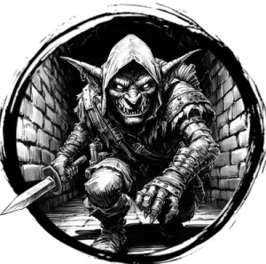

## GOBLIN

_A short, hairless humanoid with green skin and pointy ears._

**AC** 11, **HP** 5, **ATK** 1 club +0 (1d4) or 1 shortbow (far) +1 (1d4), **MV** near, **S** 0 **D** 1 **C** 1 **I** -1 **W** -1 **Ch** -2, **AL** C, **LV** 1

**Keen Senses:** Can't be surprised.

