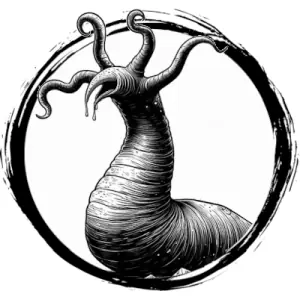

## GRICK

_A huge worm with four suckered tentacles and a snapping beak._

**AC** 14, **HP** 19, **ATK** 1 beak +3 (1d8) and 1 tentacle +3 (1d6 + grab), **MV** near (climb), **S** 3 **D** 2 **C** 1 **I** -3 **W** 1 **Ch** -3, **AL** N, **LV** 4

**Camouflage:** Hard to see in cave terrain or rocks.

**Grab:** Target is immobilized. DC 15 Strength check on turn to break free.

