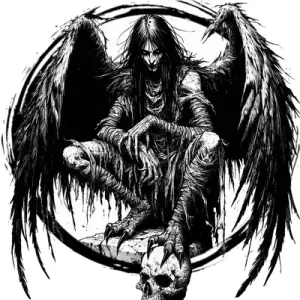

## HARPY

_Horrific, winged women with vulture-like lower bodies. They keen a hypnotic song._

**AC** 13, **HP** 14, **ATK** 2 claw +3 (1d6) or 1 song, **MV** near (fly), **S** 1 **D** 3 **C** 1 **I** 0 **W** 0 **Ch** 1, **AL** C, **LV** 3

**Song:** Enemies who can hear within double near DC 12 CHA or dazed and drawn to harpy for 1d4 rounds. Immune for 1 day if passed check.

