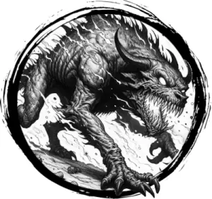

## HELL HOUND

_Black wolfhounds with red eyes and jaws dripping with flames._

**AC** 13, **HP** 19, **ATK** 2 bite +4 (1d8) or 1 fire breath, **MV** double near, **S** +2 **D** +1 **C** +1 **I** -2 **W** +1 **Ch** -3, **AL** C, **LV** 4

**Impervious:** Fire immune.

**Fire Breath:** Fills a near-sized cube extending from hell hound. DC 15 DEX or 3d8 damage.

