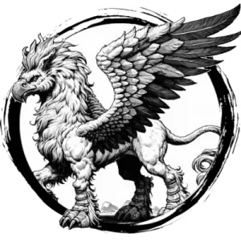

## HIPPOGRIFF

_Fierce, winged creatures with the lower body of a horse and upper body of a giant eagle._

**AC** 13, **HP** 14, **ATK** 2 rend +3 (1d8), **MV** double near (fly), **S** 3 **D** 3 **C** 1 **I** -3 **W** 1 **Ch** -2, **AL** N, **LV** 3

