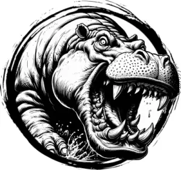

## HIPPOPOTAMUS

_Ornery river-beasts as large as cows with round, purple bodies and bulbous snouts._

**AC** 12, **HP** 24, **ATK** 2 bite +4 (1d10), **MV** near (swim), **S** +4 **D** +0 **C** +2 **I** -3 **W** +0 **Ch** -3, **AL** N, **LV** 5

**Stumpy:** ADV on STR checks to grab or drag other creatures.

