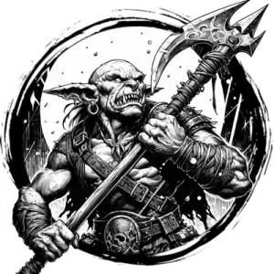

## HOBGOBLIN

_A sturdy, tall goblin with russet skin. Militant and strategic._

**AC** 15, **HP** 10, **ATK** 1 longsword +3 (1d8) or 1 longbow (far) +0 (1d8), **MV** near, **S** +3 **D** +0 **C** +1 **I** +2 **W** +1 **Ch** +1, **AL** C, **LV** 2

**Phalanx:** +1 to attacks and AC when in close range of an allied hobgoblin.

