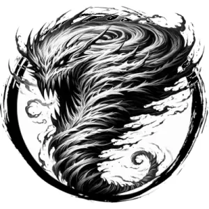

## LESSER ELEMENTAL, AIR

_A howling tornado of wind._

**AC** 16, **HP** 29, **ATK** 3 slam +7 (2d6) or 1 whirlwind, **MV** double near (fly), **S** 3 **D** 5 **C** 2 **I** -2 **W** 1 **Ch** -2, **AL** N, **LV** 6

**Impervious:** Only damaged by magical sources.

**Whirlwind:** All within close DC 15 DEX or flung 2d20 feet in random direction.

