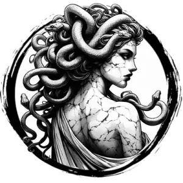

## MEDUSA

_Immortal women with coiling snakes for hair and scaled skin._

**AC** 14, **HP** 38, **ATK** 1 snake bite +6 (1d6 + poison), **MV** near, **S** 2 **D** 1 **C** 2 **I** 2 **W** 3 **Ch** 4, **AL** C, **LV** 8

**Godborn:** Hostile spells targeting the medusa are DC 15 to cast.

**Petrify:** Any creature (including medusa) who looks directly at medusa, DC 15 CON or petrified.

**Poison:** DC 15 CON or go to 0 HP.

