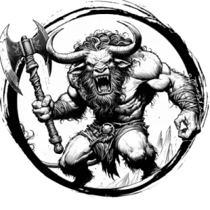

## MINOTAUR

_Ferocious bull-men with hooves and curved horns. They live in mazelike tunnels._

**AC** 14 (chainmail), **HP** 34, **ATK** 2 greataxe +6 (1d10) and 1 horns +6 (1d12), **MV** near, **S** +4 **D** +1 **C** +3 **I** +1 **W** +2 **Ch** +1, **AL** C, **LV** 7

**Charge:** In place of attacks, move up to double near in a straight line and make 1 horn attack. If hit, x2 damage.

