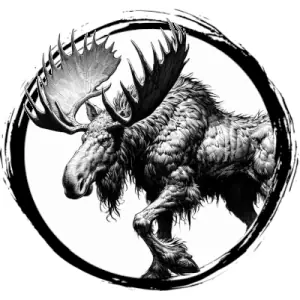

## MOOSE

_A towering, brown-haired grazer with weighty, flat antlers._

**AC** 11, **HP** 19, **ATK** 2 antler +3 (1d6), **MV** double near, **S** +3 **D** +0 **C** +1 **I** -2 **W** +0 **Ch** -2, **AL** N, **LV** 4

