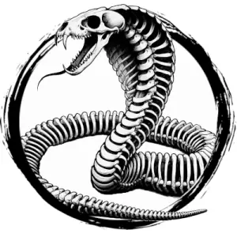

## NAGA, BONE

_Mindless, skeletal husks of nagas reanimated by sorcery._

**AC** 13, **HP** 31, **ATK** 2 bite +5 (2d6), **MV** near (burrow, **S** 3 **D** 2 **C** 4 **I** -3 **W** 0 **Ch** 4, **AL** C, **LV** 6

**Greater Undead:** Immune to morale checks. Only damaged by silver or magical sources.

