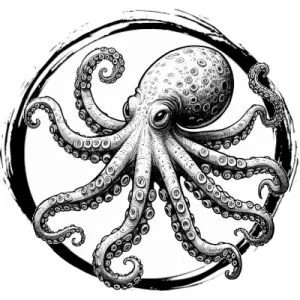

## OCTOPUS, GIANT

_Octopi as large as sailing skiffs._

**AC** 13, **HP** 23, **ATK** 2 tentacle (near) +4 (1d8 + grab), **MV** near (swim), **S** 3 **D** 3 **C** 1 **I** -2 **W** 1 **Ch** -3, **AL** N, **LV** 5

**Grab:** DC 15 STR or immobilized.

**Tentacle auto-hits each round:** DC 15 STR on turn to break free.

**Ink:** In place of attacks, ink cloud blinds all in near for 1d4 rounds.

