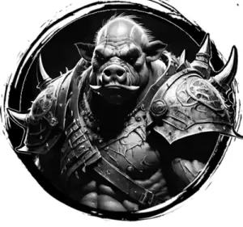

## ORC, CHIEFTAIN

_An imposing orc with scars crisscrossing its body._

**AC** 14 (chainmail), **HP** 19, **ATK** 2 greataxe +4 (1d10), **MV** near, **S** 2 **D** 1 **C** 1 **I** -1 **W** 0 **Ch** -1, **AL** C, **LV** 4

**Rage:** 1/day, immune to morale checks, +1d4 damage (3 rounds).

