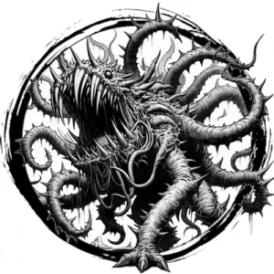

## OTYUGH

_Stumpy, three-legged beasts with barbed tentacles and vast mouths. Drawn by rot and filth._

**AC** 13, **HP** 35, **ATK** 2 tentacle +5 (1d8) and 1 bite +5 (1d10 + disease), **MV** near, **S** +4 **D** -1 **C** +4 **I** -2 **W** +0 **Ch** -3, **AL** N, **LV** 7

**Disease:** DC 15 CON or infected. DC 15 CON each day or lose 1d6 HP (can't heal). Ends on success.

