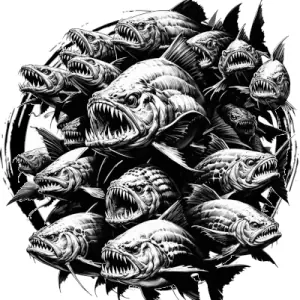

## PIRANHA, SWARM

_A school of flat, silvery fish with vicious fangs._

**AC** 12, **HP** 13, **ATK** 2 bite +2 (1d6), **MV** near (swim), **S** -2 **D** +2 **C** +0 **I** -3 **W** +0 **Ch** -3, **AL** N, **LV** 3

**Savage:** ADV on attacks against creatures below half their HP.

