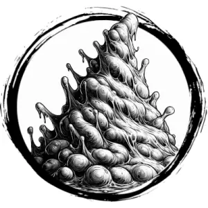

## PRIMORDIAL SLIME

_A mass of clear ooze strobing with sick pulses of violet light._

**AC** 9, **HP** 30, **ATK** 2 tentacle +4 (1d10 + dissolve), **MV** near (climb), **S** +3 **D** +2 **C** +3 **I** -4 **W** -3 **Ch** -4, **AL** C, **LV** 6

**Impervious:** Only harmed by fire.

**Dissolve:** One random piece of non-magical gear the target carries is destroyed.

