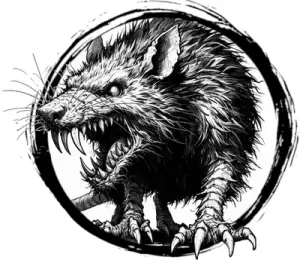

## RAT, GIANT

_Cunning rats as large as cats. Mangy fur and wormlike tails._

**AC** 11, **HP** 5, **ATK** 1 bite +1 (1d4 + disease), **MV** near, **S** -2 **D** +1 **C** +1 **I** -2 **W** +1 **Ch** -2, **AL** N, **LV** 1

**Disease:** DC 12 CON or 1d4 CON damage (can't heal while ill).

