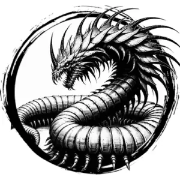

## REMORHAZ

_Massive, blue centipedes with neck hoods and red-hot spine spikes. Dwell in arctic climates._

**AC** 16, **HP** 47, **ATK** 3 bite +7 (2d6 + swallow), **MV** near (burrow), **S** +5 **D** +1 **C** +2 **I** -3 **W** +1 **Ch** -3, **AL** N, **LV** 10

**Impervious:** Immune to cold and fire.

**Melt:** Non-magical metal objects that touch the remorhaz melt on a d6 roll of 1-3.

**Swallow:** On a natural attack roll of 18-20, target is swallowed.

