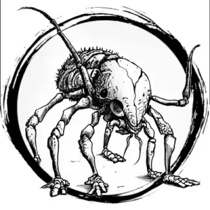

## RUST MONSTER

_A mud-brown insect as big as a wolf with two feathery antennae. Consumes metal._

**AC** 13, **HP** 19, **ATK** 2 claw +3 (1d6), **MV** near (climb), **S** 2 **D** 3 **C** 1 **I** -3 **W** 1 **Ch** -3, **AL** N, **LV** 4

**Corrosive:** Metal that touches the rust monster is destroyed on a d6 roll of 1-3.

