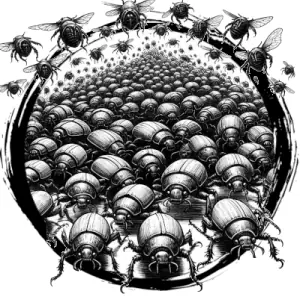

## SCARAB, SWARM

_A chittering cloud of iridescent, oval-shaped beetles._

**AC** 13, **HP** 14, **ATK** 2 bite +3 (1d6), **MV** near (fly), **S** -1 **D** 3 **C** 1 **I** -3 **W** 0 **Ch** -3, **AL** N, **LV** 3

