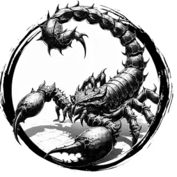

## SCORPION, GIANT

_Chitin-plated scorpions as big as camels._

**AC** 14, **HP** 13, **ATK** 1 claw +2 (1d6 + grab) and 1 sting +2 (1d4 + poison), **MV** near (climb), **S** +2 **D** +2 **C** +0 **I** -4 **W** +0 **Ch** -4, **AL** N, **LV** 3

**Grab:** DC 12 STR or target held. DC 12 STR on turn to break free.

**Poison:** DC 12 CON or go to 0 HP.

