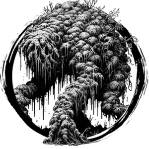

## SHAMBLING MOUND

_Fetid piles of slimy vegetation animated to life by lightning._

**AC** 14, **HP** 20, **ATK** 2 slam +3 (1d6 + engulf), **MV** near, **S** 3 **D** -2 **C** 2 **I** -3 **W** 0 **Ch** -3, **AL** N, **LV** 4

**Impervious:** Fire immune.

**Engulf:** If a target is hit by both slams in same round, it is pulled into shambling mound's body and suffocates in 2d4 rounds. DC 15 STR on turn to escape.

