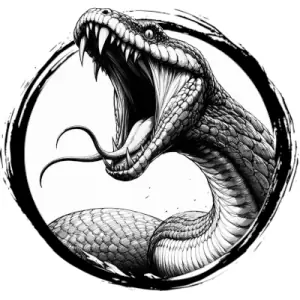

## SNAKE, GIANT

_An enormous, mottled serpent that can swallow a cow whole._

**AC** 12, **HP** 23, **ATK** 2 bite +4 (1d6) and 1 constrict (near), **MV** near (climb), **S** +3 **D** +2 **C** +1 **I** -2 **W** +0 **Ch** -2, **AL** N, **LV** 5

**Constrict:** Contested STR to hold target immobile for one round.

